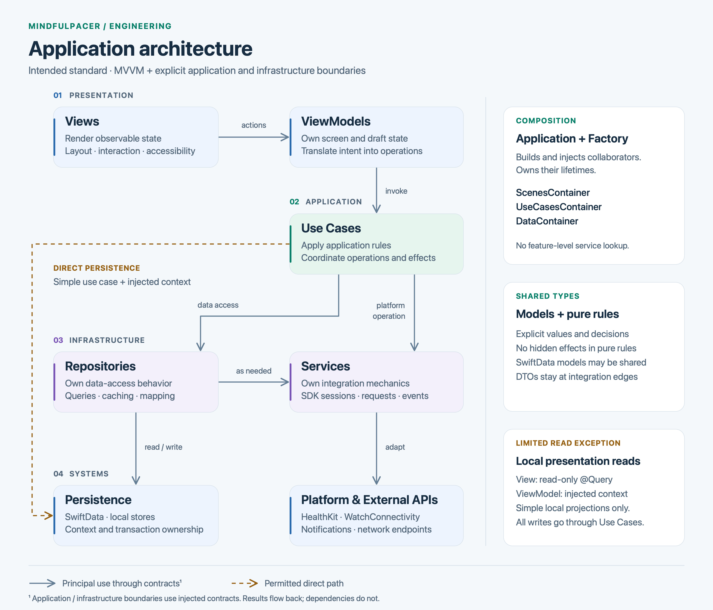

# Architecture

MindfulPacer's architectural standard combines clean architecture principles with MVVM (Model–View–ViewModel). It applies to both the iOS and watchOS applications.

**This document defines the intended architecture for new work and refactoring.** It is a design standard, not a claim that every existing implementation already conforms. Existing shortcuts do not establish new architectural rules. Change the standard when a deliberate design decision improves it; bring implementation toward the standard as the relevant code is maintained.

The goal is clear ownership: presentation describes what the user sees, use cases express what the application does, and infrastructure handles how it interacts with storage and platform APIs. Keep dependencies explicit and make application rules testable without a running UI or live external systems.

This is a working reference for implementing a feature, reviewing a change, or deciding where a responsibility belongs. It covers both the architectural boundaries and the code patterns used to express them. The standard permits small, direct implementations; it does not require a new abstraction for every function.

**How to read the examples:** types prefixed with `Example` or `DefaultExample` are illustrative templates, not claims that those types already exist in the application. The article-loading examples form one connected implementation. Examples using existing project types are identified separately and link to their source. SwiftUI examples target iOS; share the application contracts with watchOS while adapting presentation and platform integration. Imports can be combined when examples are placed in one file.

## Contents

- [Architecture overview](#architecture-overview)
- [Responsibilities](#responsibilities)
- [Dependency rules](#dependency-rules)
- [Worked example: loading a feature](#worked-example-loading-a-feature)
- [Persistence and ModelContext](#persistence-and-modelcontext)
- [Dependency injection](#dependency-injection)
- [Navigation and presentation management](#navigation-and-presentation-management)
- [Concurrency and operation lifetimes](#concurrency-and-operation-lifetimes)
- [Platform integration and background work](#platform-integration-and-background-work)
- [Errors, empty states, and diagnostics](#errors-empty-states-and-diagnostics)
- [Project structure](#project-structure)
- [Structuring SwiftUI views](#structuring-swiftui-views)
- [Testing and previews](#testing-and-previews)
- [Implementing and reviewing a feature](#implementing-and-reviewing-a-feature)
- [Source reference map](#source-reference-map)

## Architecture overview

<picture>
  <source srcset="architecture-diagram-dark.svg" media="(prefers-color-scheme: dark)">
  <source srcset="architecture-diagram-light.svg" media="(prefers-color-scheme: light)">
  
</picture>

[Light diagram](architecture-diagram-light.svg) · [Dark diagram](architecture-diagram-dark.svg)

Solid arrows show the principal direction of use; calls across application and infrastructure boundaries go through injected contracts. The dashed arrow shows the permitted direct persistence path for a simple use case. The sidebar describes composition, shared types, and the limited presentation-read exception. Results and observable state flow back to callers without creating reverse dependencies. The diagram describes logical responsibilities, not separate build targets or a requirement to pass every operation through every box.

A typical operation follows this sequence:

1. A View forwards a user action to its ViewModel.
2. The ViewModel invokes an injected Use Case and manages presentation state.
3. The Use Case applies application rules and coordinates the required data or platform operations.
4. A Repository manages data access, or a Service performs a platform operation. A simple Use Case may access its injected persistence context directly under the rules below.
5. Results return to the ViewModel, which updates the state observed by the View.

Application lifecycle events and platform callbacks can also initiate work. Their adapters forward application decisions to use cases; they do not need a screen or ViewModel to perform background work.

### Why these boundaries exist

| Design choice | What it enables |
| --- | --- |
| Views render state and forward actions | UI changes do not rewrite application rules, and application behavior can be exercised without launching a screen. |
| Use Cases name application operations | A screen, notification action, and background task can invoke the same behavior. |
| Contracts are injected | Tests can substitute a source, and platform implementations can change without changing callers. |
| Repositories own meaningful data access | Query, mapping, and cache decisions have a single owner. |
| Services isolate SDK mechanics | Framework delegates, authorization, and transport details do not spread through scenes. |
| Pure rules take explicit inputs | Time windows, thresholds, and other decisions can be verified deterministically. |
| Contexts and asynchronous work have owners | Saving, cancellation, and recovery have defined behavior instead of depending on whichever screen is alive. |

### Reading the dependency arrows

Distinguish a **call**, a **source dependency**, and a **returned result**. A Use Case calls a Repository through a protocol; the Repository implementation satisfies that protocol. Returning a result to the Use Case does not mean the Repository may depend on the Use Case's concrete class. Likewise, observable state flowing to a View does not authorize a Service to locate that View.

An application operation can follow any of these supported paths:

```text
View → ViewModel → Use Case → Repository → Service → External API
View → ViewModel → Use Case → Repository → Persistence
View → ViewModel → Use Case → Service → Platform API
View → ViewModel → Use Case → Injected ModelContext
Lifecycle adapter → Use Case → Relevant data/platform collaborators
```

The direct context path is for a small local operation with explicit save ownership. The read-only presentation exception has its own restrictions below; it is not an alternative path for mutations.

## Responsibilities

### Application layer

The application entry point and its composition code assemble the dependency graph, configure persistence, install platform delegates, and create the root scene. They decide the lifetime of shared infrastructure and connect lifecycle events to the appropriate application operations.

Construction and configuration belong here. Feature rules and screen-specific presentation logic belong in their respective layers.

Typical startup responsibilities are creating the model container, registering dependencies, installing notification and connectivity delegates, injecting the environment, and starting application-owned observations. Do not repeat that setup in each screen's `onAppear`. Repeated lifecycle callbacks should not create duplicate sessions or subscriptions.

The iOS entry point is [iOSApp.swift](../MindfulPacer/iOS/Application/iOSApp.swift); watchOS uses [WatchOSApp.swift](../MindfulPacer/WatchOS/WatchOSApp.swift). Their bootstrap mechanisms differ, but the ownership rules are the same.

### Scenes: Views and ViewModels

A scene contains the presentation for a screen or closely related flow.

| Component | Owns | Delegates |
| --- | --- | --- |
| **View** | Layout, styling, accessibility, animations, focus, local interaction state, and rendering navigation or presentation state | Application actions to its ViewModel; reusable visual behavior to Common UI |
| **ViewModel** | Observable screen state, user-action handling, loading and error presentation, selection, draft editing, and screen-level navigation intent | Application operations to injected Use Cases |

A View may format values for display and compose already prepared data. It must not perform network requests, control platform sessions, or decide business rules in its rendering code.

A ViewModel translates application results into presentation state. It does not implement platform integration, synchronization policy, or reusable business rules. Keep expensive transformations and reusable calculations in focused types with explicit inputs.

ViewModels receive their collaborators through initializers. A scene's construction boundary can resolve a ViewModel from a container; the ViewModel itself must not locate dependencies through global containers or service singletons.

Separate persistent facts from temporary screen state. The selected tab, expanded card, chart selection, loading indicator, and unsaved form values are presentation state. A saved reflection or reminder is application data. Navigation away from a screen must not silently save an unfinished draft.

Use `@Observable` for new ViewModels and isolate UI-facing mutable state to `@MainActor`. Existing `ObservableObject` and Combine implementations can be integrated through their normal ownership rules; changing wrappers alone does not improve an architectural boundary.

### Use Cases

A Use Case represents one named application operation. It owns application-level validation, preconditions, sequencing, and coordination of side effects. It may delegate reusable decisions or calculations to pure model types.

Use Cases depend on Repository and Service contracts rather than constructing their implementations. They may call a Service directly when the operation is a platform capability and there is no meaningful data-access responsibility for a Repository. For simple local persistence operations, an injected `ModelContext` is also permitted as described below.

Return values, application errors, or events that callers can interpret. Use Cases must not choose colors, construct Views, present alerts, or depend on a ViewModel. Keep them small enough to describe and test as a single operation.

Name the contract after the action, such as `FetchRoadmapUseCase` or `AddDefaultActivitiesUseCase`, and conventionally name its implementation `Default…`. Use `execute` for the operation entry point. Make required inputs explicit in its parameters rather than reading screen state or a global preference behind the caller's back. A Use Case can be synchronous when its operation is synchronous; `async` is not a requirement for every type.

Do not assume a multi-step Use Case is automatically a transaction. For “save locally, then notify another device,” define what happens if the local save succeeds but delivery fails. Return or record that distinction instead of presenting the whole operation as an unqualified failure and inviting a duplicate save.

### Repositories

A Repository presents a coherent data-access interface. It owns storage queries and mutations, caching, coordination of multiple data sources, and mapping between external data and application models where those responsibilities are needed.

Repository implementations may use persistence contexts and Service contracts. Their interface should describe the caller's data needs without exposing transport responses or requiring callers to orchestrate storage details.

Introduce a Repository when it centralizes meaningful data behavior or isolates a source that needs substitution. A forwarding-only Repository is not required for every Service or local query. Application workflow decisions remain in Use Cases; storage and data-source coordination remain in Repositories.

A Repository that caches data should define freshness, invalidation, and failure behavior. For example, returning cached data after a failed refresh is a deliberate policy, not the same as a successful fresh fetch. If the caller must display that difference, expose it in the result. Specify ordering and pagination at the data boundary rather than making each screen reconstruct them.

### Services

A Service adapts a platform or external capability, such as HealthKit, WatchConnectivity, notifications, networking, or operating-system background execution.

Services own SDK-specific mechanics: sessions, queries, delegates, subscriptions, request encoding, and resource cleanup. They expose capabilities and results through narrow contracts. Translate framework failures into useful boundary errors while preserving diagnostic details.

Services do not own screen state or decide when an application workflow should occur. Long-lived platform services can produce observations and events; application orchestration consumes those events and applies the relevant rules. Keep SDK lifecycle mechanics separate from reusable business decisions, even when both participate in one feature.

Prefer a capability-oriented protocol over a protocol that exposes an entire SDK object. A health-reading contract can accept a measurement and date range and return samples; it need not expose `HKHealthStore` to its callers. Define whether results arrive once or as a stream, what cancellation stops, and which isolation boundary delivers callbacks.

### Models and pure rules

Distinguish three responsibilities:

- **Application models and pure rules** express the application's concepts, values, and deterministic decisions. Pure rules take explicit inputs and return results without UI, storage, network, or global-service access.
- **Persistence models** define stored entities, relationships, and schema behavior. Shared SwiftData models are permitted across layers; the use of a model does not grant permission to mutate or save it from any layer.
- **DTOs** describe external serialization formats. Keep them at integration boundaries and map them before exposing data to presentation code.

This is a pragmatic architecture: a separate framework-free entity hierarchy is not mandatory for every SwiftData model. Prefer value snapshots or dedicated result types when they make a boundary clearer or keep presentation independent of a storage schema.

| Kind of type | Suitable contents | Keep out |
| --- | --- | --- |
| Application value | Stable identifier, timestamp, units, domain meaning | Network response parsing and screen navigation |
| Pure rule | A calculation or decision over explicit inputs | `Date.now`, a singleton lookup, a database query, or a notification side effect hidden inside the calculation |
| Persistence model | Stored properties, relationships, schema-compatible defaults | Screen loading state and transient form state |
| DTO | Serialized field names, wire-format values, protocol version | SwiftUI layout and persistence save behavior |
| Presentation model | Display text, grouping, selection, visual status | Authority over the underlying saved record |

Use stable identifiers when mapping a DTO or rebuilding a presentation value. Generating a new UUID during every render or fetch makes the same logical item look new to SwiftUI and complicates reconciliation. For time-dependent rules, supply the reference date and calendar explicitly; the caller decides when “now” is captured.

### Common UI and Extensions

Common UI contains reusable components, styles, modifiers, and presentation formatters. Components receive values, bindings, and action closures. They must not fetch application data, resolve dependencies, or embed feature-specific application rules.

Extensions add focused behavior appropriate to the extended type. Keep feature orchestration in named collaborators rather than hiding it in broadly available extensions. Share code between platforms when its responsibility and dependencies are genuinely shared.

Examples of suitable Common UI responsibilities include a selectable control, a labeled card, a chart that receives prepared samples, a toast renderer, and a date formatter used in multiple screens. A card may expose `onOpen` and `onSelectItem` closures; it should not resolve a scene container or decide how an application record is saved. A method on `Date` may format a date, but must not query HealthKit as an invisible side effect.

## Dependency rules

These are rules for new and refactored code, including code that shares a build target.

| Consumer | Permitted dependencies | Boundary |
| --- | --- | --- |
| View | ViewModel, presentation models, Common UI; limited local reads described below | No direct Service or Repository calls, persistence writes, or application orchestration |
| ViewModel | Use Case contracts, presentation helpers, models; limited local reads described below | No concrete infrastructure construction or global dependency lookup |
| Use Case | Repository and Service contracts, models and pure rules; injected persistence for simple operations | No presentation-layer dependencies |
| Repository implementation | Service contracts, persistence, mapping helpers, models | No Views, ViewModels, or application workflow orchestration |
| Service implementation | Platform SDKs, external APIs, DTOs and boundary models | No presentation dependencies or feature workflow decisions |
| Pure rule | Explicit input values and other pure rules | No side effects or hidden dependencies |
| Composition code | Concrete implementations and their contracts | Constructs and connects dependencies; does not become a feature-logic layer |

Define contracts around what their consumers need. Infrastructure implements those contracts; application code receives the implementations through injection. A result, callback, or event returning to a caller does not authorize a lower layer to import or locate that caller's ViewModel.

Keep the dependency graph acyclic. When two components need each other, extract the shared responsibility or introduce an explicit coordinator at the application boundary. Do not route lower-level work through UI objects.

Asynchronous operations and subscriptions need an explicit owner and lifetime. Keep UI state on its appropriate UI isolation boundary and respect the ownership of persistence contexts. Cancellation, completion, and errors must have a defined path back to the caller; presentation code chooses how to display them.

## Worked example: loading a feature

The following example connects the boundaries rather than leaving each one as an unrelated skeleton. It loads article summaries through a Service, maps them in a Repository, exposes the operation through a Use Case, and renders the result through a ViewModel and View. It is a template for the intended standard, not a replacement implementation for the existing Outreach feature.

### Values and transport types

The DTO mirrors serialization. The application value has a validated URL and preserves the source identifier. Both are immutable, `Sendable` values so they can cross an isolation boundary without carrying a persistence context or UI object.

```swift
import Foundation

struct ExampleArticleDTO: Decodable, Sendable {
    let id: UUID
    let title: String
    let url: String
}

struct ExampleArticle: Identifiable, Equatable, Sendable {
    let id: UUID
    let title: String
    let url: URL

    init(dto: ExampleArticleDTO) throws {
        guard let url = URL(string: dto.url),
              let scheme = url.scheme?.lowercased(),
              ["https", "http"].contains(scheme),
              url.host != nil else {
            throw ExampleArticleError.invalidArticleURL(dto.id)
        }
        self.id = dto.id
        self.title = dto.title
        self.url = url
    }
}

enum ExampleArticleError: Error {
    case invalidResponse
    case rejectedStatus(Int)
    case invalidArticleURL(UUID)
}
```

Mapping is strict here: one invalid article fails the response. Another feature may deliberately accept partial results, but must document that choice and make skipped data diagnosable. Silently dropping invalid items with `try?` would conceal a different behavior.

### Service: perform the external request

The Service receives the session and endpoint from composition. It handles HTTP and decoding, and does not decide how an error appears on screen. Network errors and cancellation propagate to its caller.

```swift
protocol ExampleArticleService: Sendable {
    func fetchArticles() async throws -> [ExampleArticleDTO]
}

final class DefaultExampleArticleService: ExampleArticleService {
    private let session: URLSession
    private let endpoint: URL

    init(session: URLSession, endpoint: URL) {
        self.session = session
        self.endpoint = endpoint
    }

    func fetchArticles() async throws -> [ExampleArticleDTO] {
        let (data, response) = try await session.data(from: endpoint)
        try Task.checkCancellation()
        guard let response = response as? HTTPURLResponse else {
            throw ExampleArticleError.invalidResponse
        }
        guard (200..<300).contains(response.statusCode) else {
            throw ExampleArticleError.rejectedStatus(response.statusCode)
        }
        return try JSONDecoder().decode([ExampleArticleDTO].self, from: data)
    }
}
```

This example intentionally has no cache, retry loop, or global session configuration. Add those only with an explicit owner and policy. Large decoding or data preparation work needs its own execution strategy; declaring a function `async` does not by itself guarantee that synchronous work runs off the main actor.

### Repository: map data for application callers

The Repository exposes application values and hides the response format. Its contract would remain the same if its implementation later combined a local cache with the service.

```swift
protocol ExampleArticleRepository: Sendable {
    func fetchArticles() async throws -> [ExampleArticle]
}

final class DefaultExampleArticleRepository: ExampleArticleRepository {
    private let service: any ExampleArticleService

    init(service: any ExampleArticleService) {
        self.service = service
    }

    func fetchArticles() async throws -> [ExampleArticle] {
        let response = try await service.fetchArticles()
        try Task.checkCancellation()
        return try response.map { try ExampleArticle(dto: $0) }
    }
}
```

### Use Case: expose the application operation

This operation currently delegates without additional policy. That is acceptable for a stable feature entry point. Do not invent filtering or validation merely to make a Use Case look substantial. When application rules are needed, this is where their sequencing belongs.

```swift
protocol ExampleFetchArticlesUseCase: Sendable {
    func execute() async throws -> [ExampleArticle]
}

final class DefaultExampleFetchArticlesUseCase: ExampleFetchArticlesUseCase {
    private let repository: any ExampleArticleRepository

    init(repository: any ExampleArticleRepository) {
        self.repository = repository
    }

    func execute() async throws -> [ExampleArticle] {
        try await repository.fetchArticles()
    }
}
```

The existing [roadmap Repository](../MindfulPacer/iOS/Data/RoadmapRepository.swift) and [roadmap Use Case](../MindfulPacer/iOS/Use%20Cases/Settings/FetchRoadmapUseCase.swift) illustrate this division with project types.

### ViewModel: own screen state and protect against stale results

The ViewModel is main-actor isolated because it owns observed screen state. Its dependency is a `Sendable` operation contract. The initializer only assigns dependencies; the caller starts loading explicitly. A request identity prevents an older, slower response from replacing a newer refresh, even if the underlying source does not cooperate with cancellation.

```swift
import Observation

@MainActor
@Observable
final class ExampleArticlesViewModel {
    // MARK: - Dependencies

    private let fetchArticles: any ExampleFetchArticlesUseCase

    // MARK: - State

    private(set) var articles: [ExampleArticle] = []
    private(set) var isLoading = false
    private(set) var errorMessage: String?
    @ObservationIgnored private var requestID = UUID()

    // MARK: - Initialization

    init(fetchArticles: any ExampleFetchArticlesUseCase) {
        self.fetchArticles = fetchArticles
    }

    // MARK: - View Lifecycle and User Actions

    func load() async {
        let request = UUID()
        requestID = request
        isLoading = true
        errorMessage = nil
        defer {
            if requestID == request { isLoading = false }
        }

        do {
            let result = try await fetchArticles.execute()
            try Task.checkCancellation()
            guard requestID == request else { return }
            articles = result
        } catch is CancellationError {
            // Leaving the scene or replacing a request is not a user error.
        } catch {
            guard requestID == request, !Task.isCancelled else { return }
            errorMessage = String(localized: "Articles could not be loaded. Try again.")
        }
    }
}
```

Existing articles are retained if a refresh fails. Initial loading, a successful empty result, and a failed request are distinct states. For a more complex screen, an enum can represent mutually exclusive loading states; avoid independent flags that permit impossible combinations. Dependencies and task bookkeeping are not user-editable state.

### View: compose content and forward actions

The scene owns the supplied ViewModel's lifetime with `@State`. Loading belongs to a SwiftUI task; changing `reloadID` replaces that task, and pull-to-refresh awaits the same operation. The View contains no transport or storage calls.

```swift
import SwiftUI

struct ExampleArticlesView: View {
    // MARK: Properties

    @State private var viewModel: ExampleArticlesViewModel
    @State private var reloadID = UUID()

    init(viewModel: ExampleArticlesViewModel) {
        _viewModel = State(initialValue: viewModel)
    }

    // MARK: Body

    var body: some View {
        List {
            if let message = viewModel.errorMessage {
                Section {
                    Text(message)
                    Button("Try Again", systemImage: "arrow.clockwise") {
                        reloadID = UUID()
                    }
                }
            }
            ForEach(viewModel.articles) { article in
                Link(destination: article.url) {
                    Text(article.title)
                        .foregroundStyle(Color.primary)
                }
                .accessibilityHint("Open article")
            }
        }
        .overlay {
            if viewModel.isLoading && viewModel.articles.isEmpty {
                ProgressView("Loading articles")
            } else if viewModel.articles.isEmpty && viewModel.errorMessage == nil {
                ContentUnavailableView("No articles", systemImage: "doc.text")
            }
        }
        .navigationTitle("Articles")
        .task(id: reloadID) { await viewModel.load() }
        .refreshable { await viewModel.load() }
    }
}
```

The containing flow supplies a `NavigationStack`. Do not add a second stack to every destination merely to make previews convenient. A preview can supply its own stack at the boundary.

## Persistence and ModelContext

Direct access to SwiftData is an intentional, limited option. It does not remove the ownership rules for application operations.

| Situation | Standard approach |
| --- | --- |
| A simple local list or detail projection, with no application policy or side effects | A View may use a read-only `@Query`, or a ViewModel may use an injected context for a simple read. Choose one owner for the query. |
| A read requires reusable filtering rules, combines sources, or triggers additional work | Put the operation in a Use Case; use a Repository when it owns meaningful data-access behavior. |
| An insert, update, delete, or save | Invoke a Use Case. A simple operation may use an injected context directly. |
| Persistence is reused, involves caching or synchronization, or coordinates multiple sources | Encapsulate data access in a Repository and coordinate the application workflow in a Use Case. |

A presentation read must remain a projection of locally available data. It must not quietly introduce writes, network calls, synchronization decisions, or application rules. If its responsibility grows beyond that boundary, move it behind a Use Case.

For editing, Views and ViewModels hold draft values and submit an explicit action. Binding directly to a persisted model property is a mutation, even if the View never calls `save()`; it is outside the read-only exception.

The composition boundary supplies the appropriate context. Do not construct a production container inside a ViewModel, Use Case, or Repository. Make the owner of each save operation explicit so callers can distinguish success from failure. Tests can substitute isolated persistence without reaching the production store.

### Read-only presentation queries

This example uses the existing `Reminder` model. The query is a local projection; the View only renders it and forwards the selected identifier. Sorting by stored values for presentation is within the read exception. Deciding which reminders are eligible to trigger is application policy and does not belong in this View.

```swift
import SwiftData

struct ExampleReminderList: View {
    @Query(sort: \Reminder.threshold) private var reminders: [Reminder]
    let onSelect: (UUID) -> Void

    var body: some View {
        List(reminders) { reminder in
            Button {
                onSelect(reminder.id)
            } label: {
                Text(reminder.triggerSummary)
                    .foregroundStyle(Color.primary)
            }
        }
    }
}
```

Use either this query or an injected read operation for the same displayed collection. Maintaining both without a defined relationship creates duplicate sources of truth. A filtered widget and a full list may have different projections while still referring to the same stored records.

### Drafts, validation, and explicit writes

An editor copies the fields it allows the user to change into a draft. Cancel discards the draft. Save invokes a Use Case, waits for its outcome, and only then decides whether to dismiss. The Use Case resolves the record by its stable identifier and validates against the current data; an object selected earlier may have been deleted or changed in the meantime.

The following illustrative operation changes only a reminder threshold. It uses the existing `Reminder` model and an **exclusively owned write context** supplied by composition. It is deliberately synchronous because this small local transaction contains no asynchronous operation.

```swift
struct ExampleReminderThresholdDraft {
    let reminderID: UUID
    var threshold: Int
}

enum ExampleReminderEditError: Error {
    case invalidThreshold
    case reminderNotFound
}

@MainActor
protocol ExampleUpdateReminderThresholdUseCase {
    func execute(_ draft: ExampleReminderThresholdDraft) throws
}

@MainActor
final class DefaultExampleUpdateReminderThresholdUseCase:
    ExampleUpdateReminderThresholdUseCase {
    private let context: ModelContext

    init(context: ModelContext) {
        self.context = context
    }

    func execute(_ draft: ExampleReminderThresholdDraft) throws {
        guard draft.threshold > 0 else {
            throw ExampleReminderEditError.invalidThreshold
        }
        let id = draft.reminderID
        var descriptor = FetchDescriptor<Reminder>(
            predicate: #Predicate { $0.id == id }
        )
        descriptor.fetchLimit = 1
        guard let reminder = try context.fetch(descriptor).first else {
            throw ExampleReminderEditError.reminderNotFound
        }

        reminder.threshold = draft.threshold
        do {
            try context.save()
        } catch {
            // Safe here because this context belongs exclusively to this writer.
            context.rollback()
            throw error
        }
    }
}

@MainActor
func makeExampleReminderWriter(
    container: ModelContainer
) -> any ExampleUpdateReminderThresholdUseCase {
    let context = ModelContext(container)
    context.autosaveEnabled = false
    return DefaultExampleUpdateReminderThresholdUseCase(context: context)
}
```

The positive-threshold check demonstrates application validation; a complete operation must apply all rules for its measurement and supported settings. It must also explicitly coordinate any required mirror, notification, or cache updates. Those effects are omitted from this local-write example, not implicitly performed by `save()`.

Do not call `rollback()` on a shared context as a generic error handler: it may undo unrelated changes. If a Use Case uses a shared context, define how it restores only its own changes or move the transaction to a dedicated writer. A failed save must not leave changes pending for a later autosave to commit after the UI has reported failure.

### Containers, contexts, and schema evolution

| Concern | Standard |
| --- | --- |
| Container lifetime | Construct the production container at application composition and reuse it for its intended store. |
| Context ownership | Use the main context on its actor, or a context owned by an isolated writer. Do not pass live models or contexts arbitrarily between tasks. |
| Save ownership | One operation defines when a change is committed and what success means. Avoid a ViewModel and Repository both trying to save the same workflow. |
| Post-save refresh | Define how other projections observe or reload committed changes, especially when a separate writer context is used. Do not assume every in-memory model instance has refreshed. |
| Schema changes | Update the versioned schema and migration strategy deliberately; preserve identifiers and relationships. Validate existing-store upgrades, not only clean installs. |
| Tests and previews | Use an explicitly configured in-memory container with CloudKit disabled; never fall back to the production store. |
| Store initialization failure | Use an intentional recovery/reporting policy. Silently deleting the user's store is not a routine migration strategy. |

The shared schema and current container definitions are in [SchemaV1.swift](../MindfulPacer/Shared/Models/Persistence/SchemaV1.swift). Production persistence currently configures a private CloudKit database. A local save and successful remote synchronization are different events; callers must not interpret one as proof of the other.

## Dependency injection

Factory is the project's dependency-injection mechanism. Its containers form part of the composition boundary:

- `ScenesContainer` assembles ViewModels and their collaborators.
- `UseCasesContainer` assembles application operations.
- `DataContainer` assembles Repository implementations and their data dependencies.
- Application setup supplies platform services, persistence, and environment values with the appropriate lifetimes.

Use initializer injection inside the dependency graph. Resolve dependencies at application or scene construction boundaries, then pass them to the objects that use them. Using Factory does not make container lookups inside feature methods an acceptable substitute for explicit dependencies.

App-wide lifetimes are appropriate for infrastructure that must be shared, such as a platform session or persistence container. A shared lifetime and global access are different choices: consumers should still receive the required collaborator explicitly. Screen-owned state should have a screen-owned lifetime.

Previews and tests provide their own collaborators through the same initializers. They should not need live network connections, production persistence, or changes to global application state to exercise a ViewModel or Use Case.

### Explicit assembly

Before introducing a container registration, the dependency graph should be understandable as ordinary initializer calls. Here is the composition for the article example; the application supplies the configured endpoint and session.

```swift
@MainActor
func makeExampleArticlesViewModel(
    endpoint: URL,
    session: URLSession
) -> ExampleArticlesViewModel {
    let service = DefaultExampleArticleService(session: session, endpoint: endpoint)
    let repository = DefaultExampleArticleRepository(service: service)
    let useCase = DefaultExampleFetchArticlesUseCase(repository: repository)
    return ExampleArticlesViewModel(fetchArticles: useCase)
}
```

### Factory registrations

Factory moves that assembly to named registration points. The following registration pattern uses existing project types and collaborators; it is an example of the composition boundary, not code to add a second time:

```swift
import Factory

extension UseCasesContainer {
    @MainActor
    var fetchRoadmapUseCase: Factory<any FetchRoadmapUseCase> {
        self {
            DefaultFetchRoadmapUseCase(
                roadmapRepository: DataContainer.shared.roadmapRepository()
            )
        }
    }
}

extension ScenesContainer {
    @MainActor
    var roadMapViewModel: Factory<RoadmapViewModel> {
        self {
            RoadmapViewModel(
                checkInternetConnectivityUseCase:
                    UseCasesContainer.shared.checkInternetConnectivityUseCase(),
                fetchRoadmapUseCase: UseCasesContainer.shared.fetchRoadmapUseCase()
            )
        }
    }
}
```

Calls to `.shared` above connect registration points inside composition. They are not a pattern for a ViewModel's action methods. The ViewModel receives its Use Cases and does not need to know Factory exists. Prefer registrations exposing the required contract when callers do not need a concrete implementation.

### Lifetimes and scope

| Dependency | Typical owner and lifetime |
| --- | --- |
| Screen ViewModel | One scene or presentation instance. Reopening an editor normally creates a fresh draft. |
| Stateless Use Case | Created as needed or retained by its consumer. No global mutable operation state. |
| Repository with a cache | Retained for the intended cache lifetime; its shared mutable state has explicit isolation. |
| Platform session or observation service | Retained by application composition for the session's intended lifetime, with explicit start/stop behavior. |
| Persistence container | Application/store lifetime. |
| Persistence context | Its actor and read/write owner; lifetime follows that ownership. |
| Navigation coordinator | The flow it coordinates, not an unrelated global service lifetime. |

A Factory registration alone does not tell the reader that an object is a singleton. Inspect and choose the scope deliberately. Avoid resolving a fresh object on each `body` evaluation, and avoid sharing an editor ViewModel globally merely to retain its dependencies. Reusable components receive values and callbacks, not containers.

For tests, initializer injection is usually simpler than overriding global registrations. When a test specifically exercises Factory wiring, scope its overrides to that test, restore them afterward, and do not run conflicting global overrides concurrently.

## Navigation and presentation management

Navigation, sheets, alerts, and transient messages are presentation concerns. Use typed destinations and presentation state so the owner and lifetime of a flow are visible.

- Views render destinations and presentations using SwiftUI.
- ViewModels own presentation intent when it follows from a user action or application result.
- Purely local interaction state, such as focus or an expanded disclosure, may remain in the View.
- A coordinator may own a flow spanning multiple scenes. Inject its interface at the appropriate presentation boundary.
- Use Cases return outcomes; they do not navigate or present UI.

Give destinations and presented items stable identities. Keep construction of destination scenes at the presentation/composition boundary. Closing a presented flow and navigating back within it are distinct actions and should have distinct ownership.

### Typed destinations and a single stack owner

Use an enum that conforms to `Hashable` for pushed destinations. Prefer identifiers or small values over carrying a live persistence graph through the path. A destination must handle the possibility that the identified record no longer exists.

```swift
enum ExampleRoute: Hashable {
    case reflection(UUID)
    case settings
}

enum ExampleSheet: Hashable, Identifiable {
    case createReflection
    case editReflection(UUID)

    var id: Self { self }
}

enum ExampleAlert {
    case saveFailed
    case discardChanges

    var title: String {
        switch self {
        case .saveFailed: String(localized: "Could not save")
        case .discardChanges: String(localized: "Discard changes?")
        }
    }
}

enum ExampleToast: String, Identifiable {
    case saved
    var id: Self { self }
}

@MainActor
@Observable
final class ExampleFlowViewModel {
    var path: [ExampleRoute] = []
    var activeSheet: ExampleSheet?
    var activeAlert: ExampleAlert?
    var activeToast: ExampleToast?

    func openReflection(id: UUID) {
        path.append(.reflection(id))
    }

    func closePresentedFlow() {
        activeSheet = nil
    }
}
```

These types can live next to the owning scene. A single `activeSheet` prevents contradictory Boolean flags from requesting several sheets at once. `id: Self` includes associated identifiers; do not use `hashValue` as an item's identifier, since a hash can collide and is not a persistent identity.

The following host demonstrates navigation and presentation ownership. Its destination content is intentionally minimal; an application destination builder constructs the real scene and injects its ViewModel there.

```swift
struct ExampleFlowView: View {
    @State private var viewModel = ExampleFlowViewModel()

    var body: some View {
        NavigationStack(path: $viewModel.path) {
            List {
                NavigationLink("Settings", value: ExampleRoute.settings)
                Button("Create Reflection") {
                    viewModel.activeSheet = .createReflection
                }
            }
            .navigationTitle("Reflections")
            .navigationDestination(for: ExampleRoute.self) { route in
                destination(for: route)
            }
        }
        .sheet(item: $viewModel.activeSheet) { sheet in
            ExamplePresentedFlow(
                sheet: sheet,
                onClose: viewModel.closePresentedFlow
            )
        }
    }

    @ViewBuilder
    private func destination(for route: ExampleRoute) -> some View {
        switch route {
        case .reflection(let id):
            Text(id.uuidString).navigationTitle("Reflection")
        case .settings:
            Text("Settings content").navigationTitle("Settings")
        }
    }
}
```

Keep `.navigationDestination` attached to a stable ancestor in the stack, not a lazily created row. Child components send navigation intent to the owner through a closure or binding; they do not create competing stacks or search for a global navigation manager.

### Sheets and closing a multi-step flow

A presented flow may own a new `NavigationStack` for its internal steps. The presenter still owns whether the entire flow is presented. Pass a closure from that presenter when a close action must dismiss the whole sheet; a local `dismiss` action deeper in the stack may refer to a different presentation level.

```swift
struct ExamplePresentedFlow: View {
    let sheet: ExampleSheet
    let onClose: () -> Void

    var body: some View {
        NavigationStack {
            Form {
                switch sheet {
                case .createReflection:
                    Text("New reflection editor")
                case .editReflection(let id):
                    Text("Editing reflection: \(id.uuidString)")
                }
            }
            .navigationTitle("Reflection")
            .toolbar {
                ToolbarItem(placement: .cancellationAction) {
                    Button("Close", systemImage: "xmark", action: onClose)
                }
            }
        }
    }
}
```

In a real editor, the ViewModel owns the draft and the save operation. Keep the sheet open if saving fails. If closing requires a discard decision, request that decision before calling `onClose`. Use `onDismiss` for presentation cleanup or an intentional refresh, not as an implicit Save action. If opening the same record must start a new editor session while it is already presented, wrap the route in a presentation object with a separate session identifier.

### Alerts and destructive confirmations

Use alert state for a decision or failure that needs acknowledgment. The modern SwiftUI alert builder supports explicit button roles and keeps action handling separate from message rendering. This modifier is a fragment to attach to the host above:

```swift
.alert(
    viewModel.activeAlert?.title ?? "",
    isPresented: Binding(
        get: { viewModel.activeAlert != nil },
        set: { if !$0 { viewModel.activeAlert = nil } }
    ),
    presenting: viewModel.activeAlert
) { alert in
    switch alert {
    case .saveFailed:
        Button("OK", role: .cancel) { }
    case .discardChanges:
        Button("Discard Changes", role: .destructive) {
            viewModel.closePresentedFlow()
        }
        Button("Keep Editing", role: .cancel) { }
    }
} message: { alert in
    switch alert {
    case .saveFailed:
        Text("Your changes have not been saved. You can try again.")
    case .discardChanges:
        Text("Your unsaved changes will be lost.")
    }
}
```

Closing the example discards only the presented draft. For deletion of a saved record, the destructive button instead invokes a deletion Use Case and handles its result; an alert confirmation is not itself a persistence operation.

### Toasts and transient feedback

Toasts confirm a nonblocking outcome. They do not replace an actionable save error. MindfulPacer's `.toast(item:)` and `.toastStyle` are custom Common UI modifiers, not built-in SwiftUI APIs; their implementation is in [Toast.swift](../MindfulPacer/iOS/Common%20UI/Views/Toast.swift) and [View+Extensions.swift](../MindfulPacer/iOS/Extensions/View+Extensions.swift).

Attach the following alongside the host's other presentation modifiers, and set `activeToast = .saved` only after a successful save:

```swift
.toast(item: $viewModel.activeToast) { toast in
    switch toast {
    case .saved:
        Toast(
            title: String(localized: "Saved"),
            message: String(localized: "Your changes were saved.")
        )
        .toastStyle(.success)
    }
}
```

The presentation component owns the toast's display and dismissal timing. The ViewModel owns the event that requests it. When repeated identical events must restart an already-visible toast, give each event its own identity instead of relying on a single enum case to signal a new occurrence.

## Concurrency and operation lifetimes

Architecture includes where work runs and who can stop it. State the isolation of a boundary in its contract; do not depend on an assumed callback queue or incidental call site.

| Responsibility | Isolation and lifetime |
| --- | --- |
| ViewModel state and presentation intent | `@MainActor`, owned by the scene or flow. |
| Short main-context persistence operation | Main-actor isolated Use Case or Repository, with its save owner explicit. |
| Background persistence | A dedicated context owned by an actor or `@ModelActor`; return identifiers or value snapshots. |
| Mutable shared cache | An actor or another justified synchronization mechanism. |
| Network and platform observations | Service-defined lifetime, cancellation, and result isolation; no assumption that callbacks arrive on the main actor. |
| Small deterministic rules | Synchronous value transformations. Larger work needs an explicit execution strategy. |

### Cancellation and replacement

For work needed only while a scene is visible, prefer `.task` or `.task(id:)` calling an async ViewModel method, as in the worked example. A changed identifier cancels the old task; cancellation is cooperative, so the operation and its adapters must honor it. Use a request identity as well when old completions could overwrite newer state.

When a button starts an unstructured `Task`, its owner must define whether a second tap cancels, replaces, or rejects the first operation. Retain a handle when explicit cancellation is needed. Avoid starting a second unstructured task inside an async method and immediately returning: the caller could then no longer await or cancel the work it requested.

Do not treat cancellation as a user-facing failure. After an `await`, confirm that the request is still current before changing observable state. If a mutation has already committed, cancellation of the presentation does not undo that commit; define how its outcome is recorded and any remaining application-owned effects are completed.

### Streams, callbacks, and cleanup

Use `async throws` for a single result and a documented observation mechanism for repeated events. Existing callback and Combine contracts can remain where useful; they still need explicit ownership and cancellation behavior.

For an SDK bridge, specify exactly when completion occurs, ensure a continuation resumes exactly once, and terminate the underlying observation when its subscriber is finished. Retain Combine cancellables, notification tokens, timers, and platform queries at the same lifetime as their owner. Stop them explicitly when the operation or session ends. A disappearing screen must not stop an application-owned monitoring session merely because it was observing that session.

### Safe boundaries

Transfer immutable `Sendable` snapshots across actors instead of live SwiftData entities. `@unchecked Sendable` does not make an entity or SDK object thread-safe. New code should use checked conformance or isolation; any unavoidable escape hatch needs a documented safety invariant and a narrow boundary.

`Task { }` may inherit actor isolation, and `async` does not mean “background thread.” Avoid blocking UI work with synchronous waits or semaphores. Use `async let` or task groups for independent operations when concurrency provides a benefit; keep dependent writes and side effects ordered. Actor reentrancy across `await` also means “inside an actor” is not the same as an atomic multi-step transaction.

Check the relevant target's Swift language mode, strict concurrency, and default-isolation settings before changing concurrency annotations. The architecture does not require a blanket `@MainActor` on infrastructure or blanket suppression of compiler diagnostics.

## Platform integration and background work

The same application boundaries apply to phone screens, watch screens, notifications, and background callbacks. Their entry points and available platform capabilities differ.

### iOS and watchOS composition

iOS currently assembles scenes through Factory containers. watchOS initializes long-lived collaborators through [Services.swift](../MindfulPacer/WatchOS/Services/Services.swift) and its app entry point. These are different bootstrap mechanisms, not different rules about which layer should own business decisions. New or refactored watch code should receive its required capabilities explicitly.

Share deterministic calculations, identifiers, message values, and model semantics when both platforms need them. Keep platform-specific sessions, authorization flows, UI navigation, and haptics in their platform layers. A watchOS type should not import an iOS scene to reuse a calculation.

### Health data and monitoring

HealthKit adapters own authorization requests, SDK queries, observer setup, session mechanics, and cleanup. Application operations decide the requested measurement, date window, eligibility rules, and response to observations. Pure evaluators receive timestamped values and configuration; they return decisions without directly scheduling notifications or writing reflections.

An observed health event therefore follows this conceptual flow:

```text
HealthKit callback
  → Service converts the event to application values
  → Application operation evaluates the relevant rule
  → Explicit persistence / notification / connectivity effects
  → Observable status or a result for interested presentation owners
```

Do not equate a missing sample with a numeric zero. Keep units, aggregation, timestamps, and query windows explicit. Permission status, no available readings, loading, and query failure can require different presentation. Expensive sample preparation should be performed at a data-change boundary, not repeatedly inside each chart mark's rendering code.

### Persistence, messaging, and snapshots

CloudKit-backed persistence, WatchConnectivity delivery, and App Group snapshots serve different purposes. They are not interchangeable acknowledgments of the same operation.

| Mechanism | Architectural responsibility |
| --- | --- |
| SwiftData / CloudKit store | Durable application records and their persistence synchronization. |
| WatchConnectivity | Device-to-device commands, events, or current configuration delivered by an explicit transport policy. |
| App Group snapshot | A compact projection for an extension or background consumer, with defined freshness and versioning. |

Each message or mirror contract should identify the authoritative source, stable record/event identifiers, supported version, ordering requirements, acknowledgment meaning, and duplicate-delivery behavior. Receiving the same event twice must not unintentionally create two records or two user notifications. Queued delivery is not proof of receipt, and receipt is not proof that an application operation committed.

A storage adapter owns persistence of a snapshot; a Use Case or application coordinator decides when to publish or rebuild it. Include enough information to detect stale or incompatible snapshots. Widgets and complications should render those prepared values and use their intended update mechanisms, rather than trying to bootstrap the full foreground scene graph.

### Background execution and recovery

An operating-system callback starts an application-owned operation with an execution budget and an expiration path. The platform adapter owns the SDK completion contract; the operation owns application validation and effects. Persist progress needed for recovery when process termination is possible, and make repeatable operations idempotent where retries may occur.

Session recovery should reconstruct durable application state and reattach SDK observations without relying on a ViewModel that happened to exist before termination. Foreground views observe the resulting status when they appear. Do not assume a background launch has a visible scene, an unlocked store, an active connection, or permission to present UI.

These are architectural responsibilities, not a claim that every existing platform integration has already been separated into these components.

## Errors, empty states, and diagnostics

Keep an error's technical cause separate from its presentation. A Service can report a transport or authorization failure; a Use Case can add application context; a ViewModel chooses the localized message and available recovery action. Preserve the underlying error for diagnostics instead of collapsing every failure into an empty array.

| Outcome | Expected handling |
| --- | --- |
| Initial request pending | Loading state; avoid implying that the final result is empty. |
| Successful request with no matching data | Explicit empty state for the selected query or period. |
| Data exists but has a special shape | Render it correctly, including a single reading or a constant series; it is not empty. |
| Refresh fails while old data exists | Keep or replace old data according to the defined policy and expose the failure or freshness state. |
| Invalid draft | Keep editing available and identify the fields or rule requiring correction. |
| Save fails | Do not report success or dismiss as though the save committed; preserve the draft for retry. |
| Permission or capability unavailable | Explain the unavailable capability and any relevant action without repeatedly requesting it from rendering code. |
| Task canceled or result superseded | End that request quietly; do not overwrite newer state. |
| Local commit succeeds, later effect fails | Record the partial outcome and retry the outstanding effect according to policy; avoid repeating the completed mutation. |

Use structured diagnostics at boundaries where an operation starts, completes, fails, or is canceled. Record useful identifiers and duration when needed to investigate ordering or latency, while avoiding health values, reflection text, and other sensitive payloads in routine logs. UI error messages should be localized and actionable rather than exposing raw SDK descriptions.

An architecture that is testable should also be observable: a missing update should be traceable to a request, a persistence outcome, a transport event, or a presentation decision.

## Project structure

Organize by platform and feature, while keeping the responsibilities above recognizable. The following shows the main existing locations; it is not an exhaustive inventory or a requirement to introduce empty directories:

```text
MindfulPacer/
├── Shared/
│   ├── Common UI/       Reusable presentation shared across platforms
│   ├── Models/          Shared concepts, pure rules, persistence models and DTOs
│   ├── Errors/          Shared boundary errors
│   ├── Extensions/      Focused shared helpers
│   └── Resources/       Shared assets and localization
├── iOS/
│   ├── Application/     Entry point, composition and lifecycle wiring
│   ├── Scenes/          Feature Views, ViewModels and presentation types
│   ├── Use Cases/       Application operations and their contracts
│   ├── Data/            Repositories, storage adapters and mapping
│   ├── Services/        Platform and external integrations
│   ├── Common UI/       iOS presentation components
│   ├── Extensions/      Platform-specific helpers
│   ├── Resources/       Platform-specific resources
│   └── Preview Content/
├── WatchOS/
│   ├── WatchOSApp.swift Entry point and lifecycle wiring
│   ├── Views/           Watch scenes and their ViewModels
│   ├── Services/        Platform services and composition
│   ├── Delegates/       SDK callback adapters
│   ├── Resources/
│   └── Preview Content/
├── MindfulPacerStatus/  Widget/complication extension
├── iOSTests/            Logic, persistence and presentation tests
├── iOSUITests/          UI behavior tests
├── WatchOSTests/
└── WatchOSUITests/
```

Platform folders own platform-specific presentation and integrations. Shared code must be usable by its intended consumers without importing the other application's scene or composition code. Folder placement alone does not enforce a dependency boundary; the types' responsibilities and dependencies do.

Keep feature-specific presentation helpers beside their scene. Promote components to Common UI when they have a clear reusable interface. Keep persistence and DTO representations distinguishable from application values, even when they live under the same Models directory.

### Shared

Shared holds models and behavior needed by more than one target. `Shared/Models/Persistence` contains SwiftData entities and schema definitions; `Shared/Models/DTOs` holds serialization types. `Shared/Errors`, `Shared/Extensions`, and `Shared/Common UI` contain reusable boundary or presentation helpers. `Shared/Resources` supplies common assets and localization.

Being under Shared does not automatically make a type pure or available to every target. Check its imports, conditional compilation, and target membership. A helper used only by one scene normally stays with that scene until a second consumer establishes a useful shared contract.

### iOS

`Application` owns launch and lifecycle wiring. `Scenes` groups feature Views, ViewModels, and presentation types, with `ScenesContainer` as their composition point. `Use Cases` groups application operations by concern and includes `UseCasesContainer`. `Data` contains repositories and data adapters with `DataContainer`. `Services` isolates integrations, and `Common UI` supplies reusable presentation.

Prefer a focused feature directory to a global collection of miscellaneous Views and ViewModels. A larger scene may have subdirectories for its independently meaningful editors, sections, or components, following the surrounding project's naming conventions.

### watchOS and extensions

The watch target currently uses `Views`, `Services`, and `Delegates`, with its entry point at the target root. Apply the same logical boundaries there without renaming the entire directory structure solely for symmetry. Add use-case or data-access types when their responsibilities warrant them.

The status extension is a separate process/target consumer. Share the values and storage contracts it needs, not the full app's scene graph. Its schema, App Group access, entitlements, and refresh behavior must remain compatible with the producer of its snapshots.

## Structuring SwiftUI views

A View's structure should make its inputs, local state, rendered content, and actions easy to identify.

- Use descriptive names and consistent organization within a scene.
- Keep `body` focused on composition. Extract independently meaningful or reusable components with explicit inputs and actions.
- Own local interaction state in the View; observe injected screen state from the ViewModel. Use bindings only when the receiving component needs to edit that state.
- Apply modifiers in the order required for the intended behavior. A universal modifier ordering cannot substitute for understanding their effect.
- Keep rendering free of side effects. Forward application actions through explicit controls and lifecycle hooks to the responsible owner.
- Keep accessibility and previews alongside the component. Previews use representative state and injected dependencies.

The same boundaries support verification: test pure rules with explicit values, Use Cases with substituted dependencies, persistence adapters with isolated stores, and Views/ViewModels with representative presentation states. The architectural aim is that each responsibility can be understood and checked independently.

### Naming and organization

Use the project's established scene names, normally `FeatureView` and `FeatureViewModel`, and descriptive component names such as `LabeledCard` or `PrimaryButton`. There is no blanket rule to remove the `View` suffix. Prefer names such as `summaryHeader`, `reminderSection`, and `saveButton` over `view1` or `button2`.

A useful order is properties and dependencies, initialization, `body`, named content sections, presentation builders, and previews. Use `// MARK:` consistently with the surrounding file. The worked example above provides a complete View and ViewModel skeleton; more complex scenes can use the same grouping without adding empty sections.

### State ownership and bindings

| Pattern | Use |
| --- | --- |
| `@State private var viewModel` with an `@Observable` type | A scene retains its own model instance, including one supplied through its initializer. |
| A plain stored `let` for an `@Observable` model | A child observes a model owned elsewhere and does not need a projected binding. |
| `@Bindable` | A child or local scope needs bindings to an existing observable model; it does not establish ownership. |
| `@State private var` | View-local interaction state such as focus-related flags, an expanded disclosure, or a reload identity. |
| `@Binding` | A child intentionally edits a value owned by its parent, such as a draft field. |
| `@StateObject` / `@ObservedObject` | Owned / externally supplied models using the older `ObservableObject` mechanism. |

Do not copy an ordinary input value into `@State` just to display it: later input changes would not automatically replace that state. Copying a saved record into a draft is intentional and should have a defined editor-session lifetime. Bindings to draft fields are appropriate; bindings that directly mutate persistent entities remain writes.

### Composition and modifier behavior

Private computed properties and `@ViewBuilder` functions make a large body easier to read. Extract a separate View when a component has independent identity, state, reusable behavior, or a useful testing boundary. Splitting a body into functions alone does not guarantee fewer updates. Use `@ViewBuilder` when conditional or multiple-view construction requires it; it is unnecessary on every simple property.

Modifier order changes behavior. `padding().background(...)` includes the padding in the background, whereas `background(...).padding()` places the padding outside it. Apply clipping, overlays, content shapes, gestures, and safe-area behavior according to the required layout and hit-testing result, not a universal style checklist.

Use native controls for their interaction and accessibility behavior. Preserve native List row selection, use destructive roles for destructive actions, and avoid replacing controls with tap gestures merely to alter appearance. A compound card with its own action and separate row actions needs explicit hit regions and sibling controls; do not nest Buttons or NavigationLinks inside another Button.

### Rendering and performance

Keep database access, networking, subscriptions, sorting of large collections, and expensive sample aggregation out of `body`. Prepare reusable display data when its source or requested window changes. Use stable identifiers in `ForEach`, keep lazy row structure predictable, and avoid generating identities while rendering.

Geometry observations should publish only the value a consumer needs, and only when it changes meaningfully. Propagating every scroll-position change through a whole scene can invalidate expensive charts or lists. Keep gesture state local unless another component actually needs it. Verify scrolling, selection, and navigation together when introducing gesture arbitration.

An optimization must preserve meaning: chart downsampling must not silently change a summary, missing data must remain distinguishable from zero, and filtering must apply at the correct point relative to pagination. Test boundary conditions such as a single sample, an empty filtered window, daylight-saving changes, and deleted selections when the feature depends on them.

### Accessibility, localization, and previews

Support larger text sizes and content that grows when localized. Prefer flexible layout over fixed heights for text-bearing rows, and provide accessible labels for icon-only controls. Use text or symbols in addition to color when communicating a status or severity. Date, number, and unit formatting belongs in presentation helpers with an appropriate locale.

Provide previews with injected collaborators and representative states. A reusable component should be previewable from values and actions without launching live services. Test an interactive screen for loading, populated, empty, failed, and selected/editing states where relevant; one successful screenshot is not sufficient coverage of its state model.

## Testing and previews

Choose the smallest test boundary that can verify the behavior. Architectural separation is useful when tests can supply deterministic collaborators through ordinary initializers, without bootstrapping production services.

| Boundary | What to verify | Test setup |
| --- | --- | --- |
| Pure rule | Inputs, boundaries, units, time-window semantics, invalid/empty values | Explicit values, dates and calendars; no UI or store |
| Service | Request construction, decoding, SDK error translation, cancellation | Substitute transport/SDK adapter or controlled fixtures |
| Repository | Mapping, ordering, cache/freshness policy, duplicate handling | Stub Service and isolated storage as needed |
| Use Case | Preconditions, sequencing, results, partial failure behavior | Fake Repository/Service contracts or an isolated context |
| ViewModel | Loading, results, errors, cancellation, stale response protection, presentation intent | Stub Use Cases with controlled completion |
| Persistence | Save/delete semantics, relationships, queries, migrations | In-memory store for local behavior; a controlled file-backed fixture for migration behavior |
| View | State rendering, layout, accessibility, controls | Injected ViewModel or plain values in a hosting environment |
| UI flow | Navigation, sheets, gestures, editing, destructive confirmation | Deterministically seeded application state |

### Stub the operation, not the production singleton

These test doubles belong to the article example. They return values through the same contracts as production; no network connection is required.

```swift
enum ExampleTestFailure: Error {
    case unavailable
}

struct ExampleFetchArticlesStub: ExampleFetchArticlesUseCase {
    let result: Result<[ExampleArticle], ExampleTestFailure>

    func execute() async throws -> [ExampleArticle] {
        try result.get()
    }
}

struct ExampleArticleServiceStub: ExampleArticleService {
    let response: [ExampleArticleDTO]

    func fetchArticles() async throws -> [ExampleArticleDTO] {
        response
    }
}
```

The following Swift Testing examples check a boundary's outcome, rather than duplicating its implementation:

```swift
import Testing

struct ExampleArchitectureTests {
    @Test
    func repositoryPreservesIdentityAndMapsTheURL() async throws {
        let dto = ExampleArticleDTO(
            id: UUID(), title: "Pacing", url: "https://example.com/pacing"
        )
        let repository = DefaultExampleArticleRepository(
            service: ExampleArticleServiceStub(response: [dto])
        )

        let article = try #require(try await repository.fetchArticles().first)
        #expect(article.id == dto.id)
        #expect(article.title == dto.title)
        #expect(article.url.absoluteString == dto.url)
    }

    @Test @MainActor
    func failureDoesNotLookLikeSuccessfulEmptyContent() async {
        let model = ExampleArticlesViewModel(
            fetchArticles: ExampleFetchArticlesStub(result: .failure(.unavailable))
        )

        await model.load()

        #expect(!model.isLoading)
        #expect(model.articles.isEmpty)
        #expect(model.errorMessage != nil)
    }

    @Test @MainActor
    func emptySuccessIsNotAnError() async {
        let model = ExampleArticlesViewModel(
            fetchArticles: ExampleFetchArticlesStub(result: .success([]))
        )

        await model.load()

        #expect(!model.isLoading)
        #expect(model.articles.isEmpty)
        #expect(model.errorMessage == nil)
    }
}
```

For concurrency-sensitive behavior, use a fake that lets the test complete requests in a chosen order. Verify that an older completion cannot replace a newer result and that cancellation does not produce an error alert. Prefer controlled completion over arbitrary sleeps in logic tests.

### Isolated persistence fixtures

This helper uses the project's current schema, including its related models. It deliberately disables CloudKit even when the production container enables it:

```swift
@MainActor
func makeExampleTestContainer() throws -> ModelContainer {
    let schema = Schema(CurrentScheme.models)
    let configuration = ModelConfiguration(
        schema: schema,
        isStoredInMemoryOnly: true,
        cloudKitDatabase: .none
    )
    return try ModelContainer(for: schema, configurations: [configuration])
}
```

Seed only the records relevant to the test. Verify failed validation leaves persistence unchanged, failed saves do not later commit silently, and successful writes can be read from the intended consumer context. In-memory tests do not verify CloudKit synchronization or an existing user's schema migration; those require separate controlled integration checks.

### Preview injection

A preview uses the same View initializer as the application. For example, this empty-state preview uses the stub above and never reaches a live Service:

```swift
#Preview("Empty articles") {
    NavigationStack {
        ExampleArticlesView(
            viewModel: ExampleArticlesViewModel(
                fetchArticles: ExampleFetchArticlesStub(result: .success([]))
            )
        )
    }
}
```

Create populated and failure variants by supplying different stub results. Keep preview fixtures local to preview/test support; do not make production Views detect previews and silently substitute a different business operation.

## Implementing and reviewing a feature

Use this sequence to make a feature concrete without introducing layers that have no responsibility:

1. Identify the user or system operation, its inputs, and what counts as success. Include partial success if persistence and another effect can fail independently.
2. Decide which data is durable, which is an editor draft, and which is temporary presentation state. Identify the authoritative owner of each.
3. Define a narrow Use Case contract and any required Repository or Service contracts. Keep platform objects out of the contract unless they are intentionally part of that boundary.
4. Implement reusable decisions as pure rules with explicit time/configuration inputs. Choose the permitted direct persistence path or a Repository based on actual data responsibilities.
5. Assemble collaborators at composition and choose their lifetimes. Make actor/context ownership, cancellation, and error delivery explicit.
6. Implement the ViewModel's state transitions, including loading, empty, error, cancellation, and success behavior. Decide which results may change navigation.
7. Build the View from native controls and reusable components. Keep destination construction and sheet dismissal at the correct flow boundary.
8. Verify the operation at its relevant boundaries and preview its meaningful presentation states. Add integration/UI coverage only where that boundary is needed to prove behavior.

During review, ask whether another entry point could invoke the operation without creating the screen, whether a test can replace its external dependencies, whether a failed save can be distinguished from a failed later effect, and whether the source of every persistent mutation is clear.

Avoid common shortcuts: global dependency lookup inside feature actions; Service callbacks that locate a ViewModel; persistent-model bindings used as cancellable drafts; `try?` turning failures into successful empty content; tasks without a defined lifetime; duplicate query owners; and shared contexts passed across actors. Existing examples of these shortcuts are not additions to the standard.

Update this document when the intended boundaries change. Add rationale and a representative example rather than removing detail to make the diagram appear universally implemented. Keep the high-level diagram aligned with the dependency rules; a feature-specific implementation plan or ticket checklist belongs elsewhere.

## Source reference map

These links locate the existing mechanisms discussed above. They are navigation aids, not a statement that every line in those files already follows the intended standard.

| Concern | Source |
| --- | --- |
| iOS entry point and lifecycle | [iOSApp.swift](../MindfulPacer/iOS/Application/iOSApp.swift), [AppDelegate.swift](../MindfulPacer/iOS/Application/AppDelegate.swift) |
| watchOS entry point and composition | [WatchOSApp.swift](../MindfulPacer/WatchOS/WatchOSApp.swift), [Services.swift](../MindfulPacer/WatchOS/Services/Services.swift) |
| Scene construction | [ScenesContainer.swift](../MindfulPacer/iOS/Scenes/ScenesContainer.swift) |
| Use Case registration | [UseCasesContainer.swift](../MindfulPacer/iOS/Use%20Cases/UseCasesContainer.swift) |
| Repository registration | [DataContainer.swift](../MindfulPacer/iOS/Data/DataContainer.swift) |
| Repository mapping and operation | [RoadmapRepository.swift](../MindfulPacer/iOS/Data/RoadmapRepository.swift), [FetchRoadmapUseCase.swift](../MindfulPacer/iOS/Use%20Cases/Settings/FetchRoadmapUseCase.swift) |
| Platform service contract | [HealthKitService.swift](../MindfulPacer/iOS/Services/HealthKitService.swift) |
| Shared persistence and schema | [SchemaV1.swift](../MindfulPacer/Shared/Models/Persistence/SchemaV1.swift), [Reflection.swift](../MindfulPacer/Shared/Models/Persistence/Reflection.swift), [Reminder.swift](../MindfulPacer/Shared/Models/Persistence/Reminder.swift) |
| Snapshot storage | [BackgroundReflectionsStore.swift](../MindfulPacer/iOS/Data/BackgroundReflectionsStore.swift), [BackgroundRemindersStore.swift](../MindfulPacer/iOS/Data/BackgroundRemindersStore.swift) |
| Device messaging | [ConnectivityService.swift](../MindfulPacer/iOS/Services/ConnectivityService.swift), [WatchUpdateService.swift](../MindfulPacer/iOS/Services/WatchUpdateService.swift), [SystemDelegate.swift](../MindfulPacer/WatchOS/Delegates/SystemDelegate.swift) |
| Background scheduling | [MissedReflectionsMonitorService.swift](../MindfulPacer/iOS/Services/MissedReflectionsMonitorService.swift) |
| Watch monitoring and recovery | [HealthMonitoringService.swift](../MindfulPacer/WatchOS/Services/HealthMonitoringService.swift) |
| Widget and complication consumer | [MindfulPacerStatus.swift](../MindfulPacer/MindfulPacerStatus/MindfulPacerStatus.swift) |
| Shared deterministic behavior | [HeartRateChartScale.swift](../MindfulPacer/Shared/Models/HeartRateChartScale.swift), [ReminderHighlightState.swift](../MindfulPacer/Shared/Models/ReminderHighlightState.swift) |
| Common presentation components | [LabeledCard.swift](../MindfulPacer/iOS/Common%20UI/Views/LabeledCard.swift), [Toast.swift](../MindfulPacer/iOS/Common%20UI/Views/Toast.swift) |
| Test targets | [iOSTests](../MindfulPacer/iOSTests), [iOSUITests](../MindfulPacer/iOSUITests), [WatchOSTests](../MindfulPacer/WatchOSTests), [WatchOSUITests](../MindfulPacer/WatchOSUITests) |
