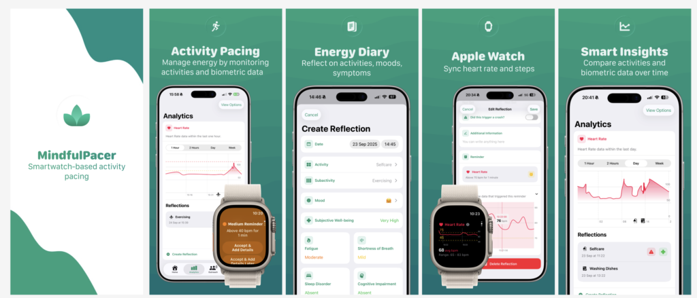

  

    
    
    

# MindfulPacer

MindfulPacer is an open-source activity pacing app for iPhone and Apple Watch. It helps users define biometric thresholds (e.g. heart rate, steps) and receive real-time notifications when those limits are exceeded — with automatic journaling to support reflection and self-management.

The app is developed as a scientific project by the [Human Aspects of Software Engineering Lab (HASEL)](https://hasel.dev) at the University of Zurich, in collaboration with the Center for Human Immunology at University Hospital Zurich.

> **Note:** MindfulPacer is not a medical device. See the [disclaimer](Docs/CONTRIBUTING.md#disclaimer) before contributing.

## Requirements

- iPhone running iOS 18.0 or later
- Apple Watch running watchOS 11.0 or later (optional — the app also works via Apple Health sync)

## Documentation

- [Architecture overview](Docs/ARCHITECTURE.md) — clean architecture, MVVM, dependency injection, project structure, and SwiftUI best practices
- [Contributing guide](Docs/CONTRIBUTING.md) — roles, gitflow, branch naming, commits, and pull request conventions

## Links

- [Website & FAQ](https://www.mindfulpacer.ch/faq)
- [App Store](https://mindfulpacer.ch/apple)
- [Contact](mailto:info@mindfulpacer.ch)

## Contributors

- Andre Meyer — Product Owner
- Grigor Dochev — Lead Developer
- Tobi Hoch — Community Lead
- Isabelle Cuber — Research Lead

See also the full list of [GitHub contributors](https://github.com/HASEL-UZH/MindfulPacer.Apple/graphs/contributors).

Third-party library acknowledgements are listed in [Docs/ACKNOWLEDGEMENTS.md](Docs/ACKNOWLEDGEMENTS.md).

## Sponsors

MindfulPacer has been made possible with the support of:

- [University of Zurich (UZH)](https://www.uzh.ch)
- [Digital Innovation Zone Hub (DIZH)](https://dizh.ch)

## License

This project is licensed under the MIT License — see [LICENSE](LICENSE) for details.
